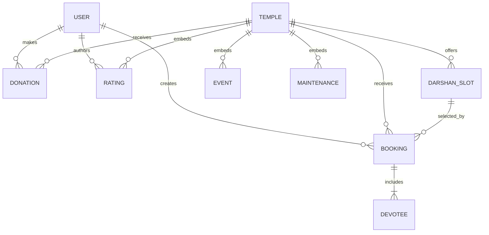

# Database Design

## Entity relationships



Events, maintenance requests, and ratings are embedded within temple documents. Devotees are embedded within booking documents. Other relationships use MongoDB `ObjectId` references.

## User

| Field | Type | Rule |
|---|---|---|
| `name` | String | Required |
| `email` | String | Required, unique, lowercase, trimmed |
| `password` | String | Required; bcrypt-hashed before save |
| `phone`, `address` | String | Default empty |
| `role` | String | `USER`, `ORGANIZER`, `ADMIN`; default `USER` |
| timestamps | Date | Mongoose `createdAt`, `updatedAt` |

## Temple

Required fields are `name`, `location`, `darshanStartTime`, and `darshanEndTime`. Optional/defaulted fields include description, image, background video, deity image/audio, amenities, embedded events, maintenance requests, ratings, and `averageRating`.

### Embedded Event

`title` and `date` are required; `description` defaults to empty. Timestamps are enabled.

### Embedded Maintenance Request

`description` is required. Status is `Pending`, `In Progress`, or `Completed`; date defaults to now. Timestamps are enabled.

### Embedded Rating

Optional user reference, required user name, numeric rating from 1–5, optional comment, and date. A controller maintains the temple’s average.

## DarshanSlot

| Field | Type | Rule |
|---|---|---|
| `temple` | ObjectId → Temple | Required |
| `date` | Date | Required |
| `startTime`, `endTime` | String | Required; format not schema-validated |
| `availableSeats`, `totalSeats` | Number | Required; no non-negative schema minimum |
| `price` | Number | Required, default 0; no non-negative schema minimum |
| timestamps | Date | Enabled |

## Booking

| Field | Type | Rule |
|---|---|---|
| `user` | ObjectId → User | Required |
| `temple` | ObjectId → Temple | Required |
| `slot` | ObjectId → DarshanSlot | Required |
| `bookingDate` | Date | Defaults to now |
| `numberOfDevotees` | Number | Required, default 1 |
| `devotees` | Embedded array | Name/age/gender required |
| `totalAmount` | Number | Required |
| `status` | String | `Pending`, `Booked`, `Cancelled`, `Expired` |
| `expiresAt` | Date | Used for pending holds |
| `ticketCode` | String | Required and unique |
| timestamps | Date | Enabled |

Gender is restricted to `Male`, `Female`, or `Other`. Age has no schema minimum/maximum; the UI checks 1–120, but direct API calls can bypass that UI rule.

## Donation

Donation references a user (schema optional, controller always supplies one) and a required temple. Amount is required with minimum 1. Purpose is restricted to `General`, `Temple Maintenance`, `Anna Danam (Food Distribution)`, `Pooja/Festival`, or `Prasadam Services`. Transaction ID is required but not unique in the schema.

## Integrity gaps

- No index prevents duplicate slots for the same temple/date/time.
- No compound or ownership model connects organizers to temples.
- Ticket codes use six random alphanumeric characters; the unique index can reject collisions, but creation is not retried.
- Transaction IDs are random eight-digit numbers and are not unique-indexed.
- Temple deletion does not cascade to slots, bookings, or donations despite the UI confirmation text claiming related details are removed.
- User deletion does not reconcile historical bookings, donations, or embedded reviews.
- Seat count changes and booking status changes are not wrapped in MongoDB transactions.
- Important numeric and date/time invariants are enforced mainly in the UI or not at all.

## Recommended indexes

```javascript
db.darshanslots.createIndex(
  { temple: 1, date: 1, startTime: 1, endTime: 1 },
  { unique: true }
);
db.bookings.createIndex({ user: 1, createdAt: -1 });
db.bookings.createIndex({ status: 1, expiresAt: 1 });
db.bookings.createIndex({ temple: 1, createdAt: -1 });
db.donations.createIndex({ transactionId: 1 }, { unique: true });
db.donations.createIndex({ user: 1, createdAt: -1 });
```

Add indexes only after checking and resolving duplicate production data.

