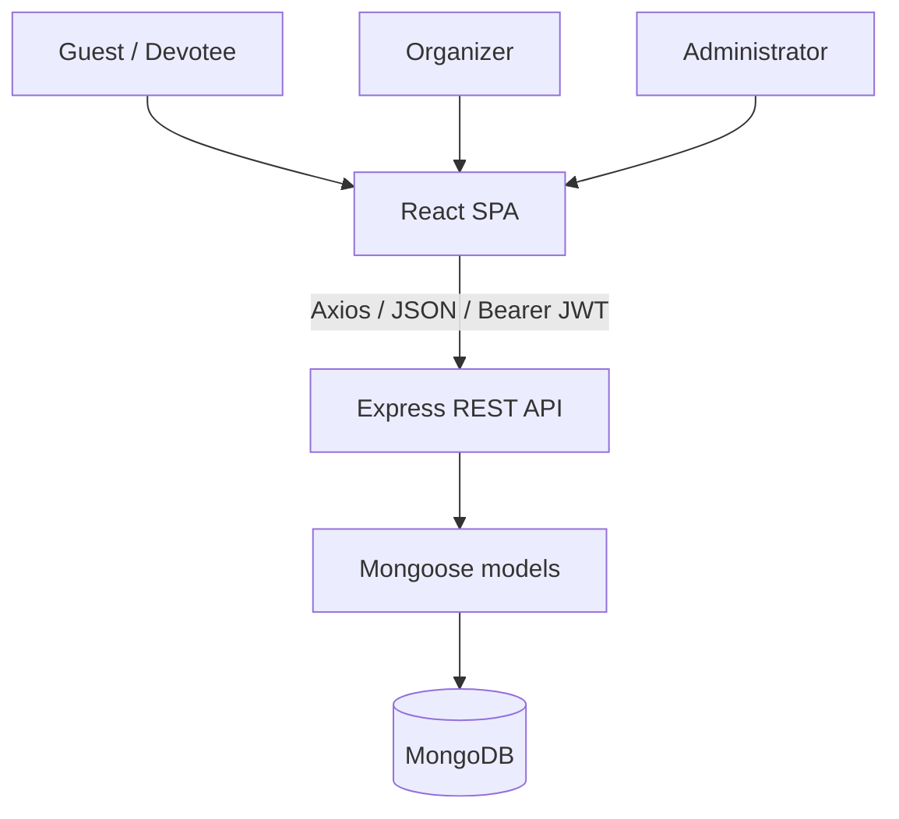
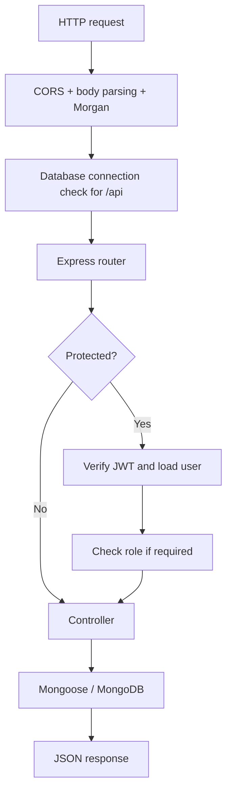

# System Architecture

## Context

The client is a Vite-built React single-page application. `AuthContext` sets a global Axios base URL and bearer header. Express mounts six API routers, checks database availability for `/api`, applies authentication/role middleware to protected routes, and uses Mongoose models for persistence.

## Runtime components

| Component | Responsibility | Key source |
|---|---|---|
| Router shell | Public pages and three dashboard URLs | `client/src/App.jsx` |
| Authentication context | Token storage, Axios configuration, profile lifecycle | `client/src/context/AuthContext.jsx` |
| Audio context/player | Temple devotional audio and mute state | `AudioContext.jsx`, `AudioFloatingPlayer.jsx` |
| Public pages | Discovery, temple detail, login/register, donation | `client/src/pages/*` |
| Role dashboards | User history/profile; organizer slots/bookings; admin management/analytics | `Dashboard*.jsx` |
| Express server | Middleware, route mounting, health/404/error responses | `server/server.js` |
| Controllers | Request validation, business operations, response mapping | `server/controllers/*` |
| Auth middleware | JWT verification and role authorization | `server/middleware/authMiddleware.js` |
| Mongoose models | User, Temple, DarshanSlot, Booking, Donation schemas | `server/models/*` |
| Seeder | Initial temples, events, ratings, and slots | `server/config/seeder.js` |

## Backend request pipeline

## Route authorization matrix

| Resource | Guest | USER | ORGANIZER | ADMIN |
|---|---:|---:|---:|---:|
| Read temples/slots | Yes | Yes | Yes | Yes |
| Review temple | No | Yes | Yes* | Yes* |
| Create/confirm own booking | No | Yes | API permits** | API permits** |
| Read own bookings/donations | No | Yes | Yes | Yes |
| Read all bookings/donations | No | No | Yes | Yes |
| Create/update/delete slot | No | No | Yes | Yes |
| Create/update/delete temple | No | No | No | Yes |
| Events and maintenance admin | No | No | No | Yes |
| User administration/analytics | No | No | No | Yes |

\* The review API accepts any authenticated role, although the UI presents reviewing as a user action.  
\** The API only requires authentication for booking creation/confirmation; the UI restricts slot booking to `USER`. Server-side role enforcement should be added.

## Booking lifecycle

```mermaid
stateDiagram-v2
  [*] --> Pending: hold created; seats deducted
  Pending --> Booked: confirmation within 5 minutes
  Pending --> Expired: expiry sweep runs after deadline
  Pending --> Cancelled: cancellation request
  Booked --> Cancelled: cancellation; seats restored
  Expired --> [*]
  Cancelled --> [*]
```

The expiry sweep is not a scheduler. It runs only when selected booking or slot controller methods call `releaseExpiredHoldBookings()`. A pending cancellation currently transitions to `Cancelled` without returning the held seats.

## Frontend route map

| Path | Page | Intended access |
|---|---|---|
| `/` | Home | Public |
| `/temple/:id` | Temple details and slots | Public; actions protected |
| `/login` | Login | Public |
| `/register` | Registration | Public |
| `/donation` | Donation | Public view; submission requires login |
| `/dashboard` | User dashboard | USER |
| `/organizer` | Organizer dashboard | ORGANIZER |
| `/admin` | Admin dashboard | ADMIN |

There is no `ProtectedRoute` component. Direct dashboard navigation may render UI for the wrong role, but API middleware remains the decisive protection for restricted data/actions.

## Design improvement priorities

1. Add server-owned registration roles and explicit organizer-temple assignments.
2. Make seat decrement and booking creation atomic with a conditional update/transaction.
3. Replace lazy expiration with a scheduled job and idempotent state transition.
4. Introduce request DTO validation, centralized async error handling, and typed API contracts.
5. Move the client API URL to an environment variable and configure a production proxy/origin policy.
6. Add route guards for user experience while retaining API authorization.
7. Introduce a real payment adapter only after defining security and compliance boundaries.

