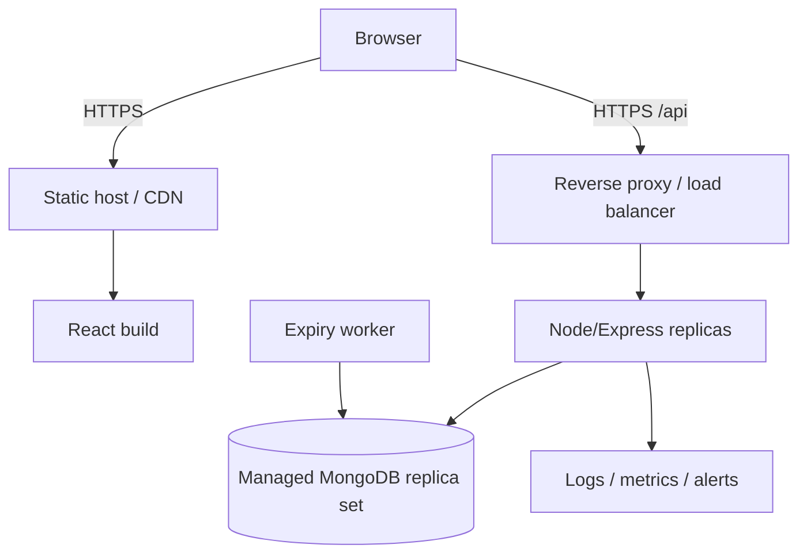

# Deployment and Operations

## Current state

The repository is configured for local development. It has no Dockerfiles, reverse-proxy config, CI/CD workflow, process manager, production database configuration, or hosted frontend API variable. The following is a recommended deployment design, not an existing one.

## Recommended topology



## Build artifacts

Frontend:

```bash
cd client
npm ci
VITE_API_BASE_URL=https://example.org/api npm run build
```

The current code must first be changed to read `VITE_API_BASE_URL`; it presently hard-codes localhost. Deploy `client/dist` to a static host or CDN and configure SPA fallback to `index.html`.

Backend:

```bash
cd server
npm ci --omit=dev
NODE_ENV=production node server.js
```

Do not deploy the committed `server/node_modules`; recreate dependencies from `package-lock.json` in a clean build.

## Required production controls

- TLS end to end and trusted-origin CORS allowlist.
- Secret manager for MongoDB credentials and JWT/session keys.
- Non-root runtime, minimal container image, dependency/build provenance, and image scanning.
- Multiple API replicas only after booking operations are concurrency-safe.
- Managed MongoDB replica set to support transactions and backups.
- Separate scheduled worker for expired holds.
- Structured logs with request/correlation IDs and redaction.
- Rate limiting and edge protection.
- Liveness for process health and readiness that verifies database/critical dependencies.
- Graceful shutdown and connection draining.

## Configuration checklist

| Setting | Development | Production |
|---|---|---|
| API URL | localhost | Environment-provided HTTPS origin |
| MongoDB | local database | Authenticated, encrypted managed cluster |
| JWT secret | local random value | Secret manager; no fallback |
| CORS | local Vite origin | Exact trusted origin allowlist |
| Logging | Morgan dev | Structured, centralized, redacted |
| Seeding | Convenient sample seed | Disabled or explicit controlled migration |

## CI/CD gates

1. Clean install from lockfiles.
2. Lint with no new warnings and formatting check.
3. Unit, integration, and E2E tests.
4. Dependency/license/secret/static security scans.
5. Frontend build and backend container build.
6. Staging deployment and API/UI smoke tests.
7. Database index/migration compatibility check.
8. Manual approval for production where required.
9. Post-deploy readiness, booking canary, and error/latency monitoring.
10. Automated rollback trigger and documented manual rollback.

## Monitoring

Track request rate, status code distribution, p50/p95/p99 latency, MongoDB errors/latency/pool saturation, booking hold/confirm/expire/cancel counts, seat reconciliation mismatches, auth failures/rate-limit events, worker backlog, process resource use, and frontend error rate.

Never log passwords, JWTs, full authorization headers, card fields, CVV, or sensitive devotee/profile data.

## Backup and recovery

- Use automated encrypted MongoDB backups with defined retention.
- Test point-in-time restoration into an isolated environment.
- Document RPO/RTO and ownership.
- Reconcile slot availability against active bookings after recovery.
- Preserve audit/financial records according to an explicit retention policy.

## Rollback

Keep the previous frontend artifact and backend image, use backward-compatible schema changes, stop/replace unhealthy backend revisions, roll frontend CDN origin/version back, and verify health plus a read-only booking/temple smoke test. Avoid destructive database rollback; use forward fixes unless a tested reversible migration exists.

